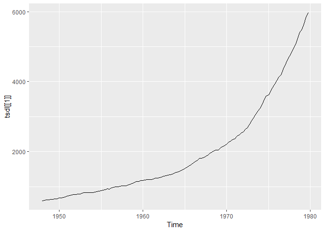

<!-- README.md is generated from README.Rmd. Please edit that file -->

# tsdl: Time Series Data Library

The Time Series Data Library (TSDL) was created by Rob Hyndman,
Professor of Statistics at Monash University, Australia.

## Installation

You can install the **development** version from
[Github](https://github.com/FinYang/tsdl)

``` r
# install.packages("devtools")
devtools::install_github("FinYang/tsdl")
```

## Usage

``` r
library(tsdl)
library(forecast)
tsdl
#> Time Series Data Library: 648 time series  
#> 
#>                        Frequency
#> Subject                 0.1 0.25   1   4   5   6  12  13  52 365 Total
#>   Agriculture             0    0  37   0   0   0   3   0   0   0    40
#>   Chemistry               0    0   8   0   0   0   0   0   0   0     8
#>   Computing               0    0   6   0   0   0   0   0   0   0     6
#>   Crime                   0    0   1   0   0   0   2   1   0   0     4
#>   Demography              1    0   9   2   0   0   3   0   0   2    17
#>   Ecology                 0    0  23   0   0   0   0   0   0   0    23
#>   Finance                 0    0  23   5   0   0  20   0   2   1    51
#>   Health                  0    0   8   0   0   0   6   0   1   0    15
#>   Hydrology               0    0  42   0   0   0  78   1   0   6   127
#>   Industry                0    0   9   0   0   0   2   0   1   0    12
#>   Labour market           0    0   3   4   0   0  17   0   0   0    24
#>   Macroeconomic           0    0  18  33   0   0   5   0   0   0    56
#>   Meteorology             0    0  18   0   0   0  17   0   0  12    47
#>   Microeconomic           0    0  27   1   0   0   7   0   1   0    36
#>   Miscellaneous           0    0   4   0   1   1   3   0   1   0    10
#>   Physics                 0    0  12   0   0   0   4   0   0   0    16
#>   Production              0    0   4  14   0   0  28   1   1   0    48
#>   Sales                   0    0  10   3   0   0  24   0   9   0    46
#>   Sport                   0    1   1   0   0   0   0   0   0   0     2
#>   Transport and tourism   0    0   1   1   0   0  12   0   0   0    14
#>   Tree-rings              0    0  34   0   0   0   1   0   0   0    35
#>   Utilities               0    0   2   1   0   0   8   0   0   0    11
#>   Total                   1    1 300  64   1   1 240   3  16  21   648
autoplot(tsdl[[1]])
```

<!-- -->

``` r
subset(tsdl,"Sales")
#> Time Series Data Library: 46 Sales time series  
#> 
#>        Frequency
#> Subject  1  4 12 52 Total
#>   Sales 10  3 24  9    46
```

## Sources

Rob Hyndman and Yangzhuoran Yang (2018). tsdl: Time Series Data Library.
v0.1.0. <https://pkg.yangzhuoranyang.com/tsdl/>

## License

This package is free and open source software, licensed under GPL-3
